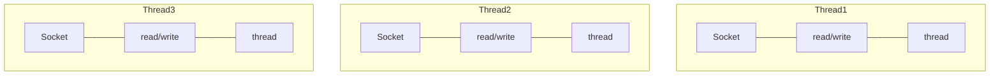

```mermaid
graph TB

subgraph Thread1
a1[Socket] --- b1[read/write] --- c1[thread]
end
subgraph Thread2
a2[Socket] --- b2[read/write] --- c2[thread]
end
subgraph Thread3
a3[Socket] --- b3[read/write] --- c3[thread]
end
```
